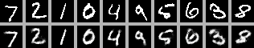

# boltzmann-machine

A restricted boltzmann machine (RBM) written entirely from scratch in C++. 

Features:

- RBM trained with contrastive divergence (CD-1)
- Custom Maths libraries covering matrix operations, activation functions and loss functions
- MNIST binary file loader
- Output visualiser (original vs reconstruction)

Tech stack: C++, Cmake

## Output

Top row consisting of the original input images and bottom row consisting of the reconstructed images



*As of now only trained on a fraction of the dataset* 

## Background and development process

I undertook this project as i wanted a better understanding of the internal workings and mathematics of neural networks, as mindlessly implementing Pytorch functions left a slight hole in my knowledge. I chose to do it in C++ as I needed to get more familiar with the language.

The first thing I wrote was the maths modules: matrix, loss and activation as these libraries would be used as a basis for everything else. Once i had all the mathematical pieces I implemented the actual RBM and the data loader before writing the training loop. Then I added a visualiser to provide a viewable evaluation of the model's performance.

## Architecture overview

1. `src/maths/matrix.cpp` — defines matrix type and operations (dot product, transpose, outer product)
2. `src/maths/activations.cpp` — defines activation functions (sigmoid, relu, tanh)
3. `src/maths/loss.cpp` — binary cross entropy loss for reconstructions
4. `src/machine/rbm.cpp` — the actual machine, containing weight initialisation, CD-1, sampling and reconstruction
5. `src/data/mnist.cpp` — binary MNIST file parser and loader
6. `src/vis/visualise.hpp` — contains the method that creates the PGM file of the visualisation
7. `src/main.cpp` — training loop and evaluation

## Build instructions

```bash
mkdir build && cd build
cmake ..
cmake --build . --config Release
cd ..
.\build\rbm.exe
```


## Development decisions

**No external dependencies:** I wanted to learn the maths that is often abstracted by libraries and so implemented it myself, as a result the model is a lot more portable.

**PGM for visualisation:** Creates a PGM file which can be opened in any image editor to produce a visual representation of the model's performance. Good for both evaluation at a quick glance and explanation of the actual concept itself